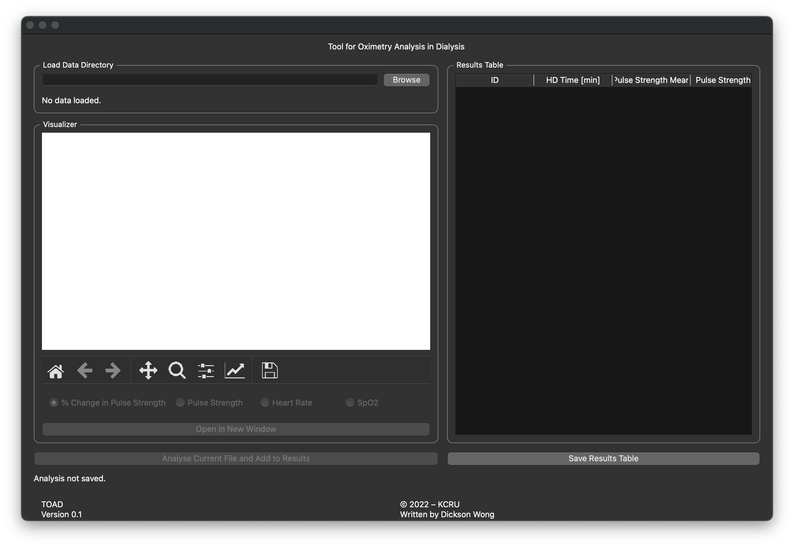
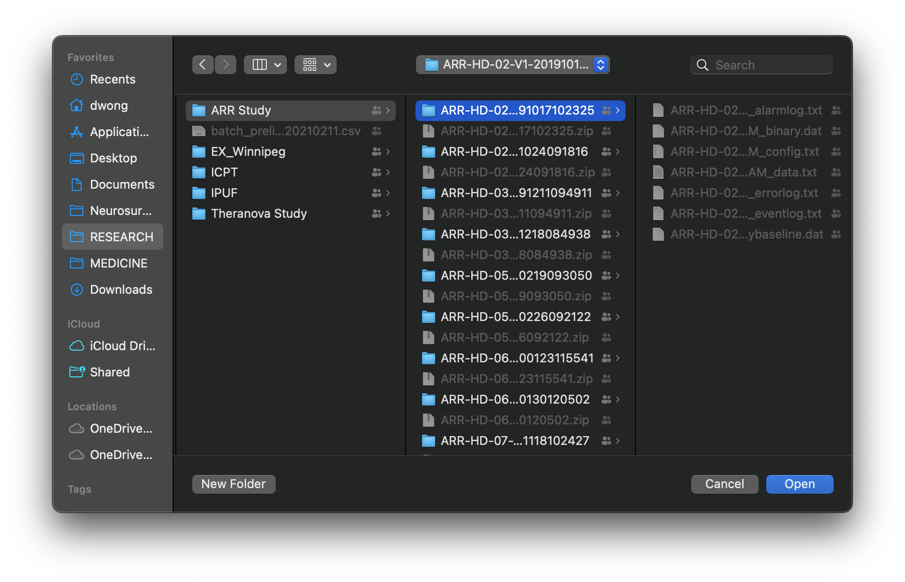
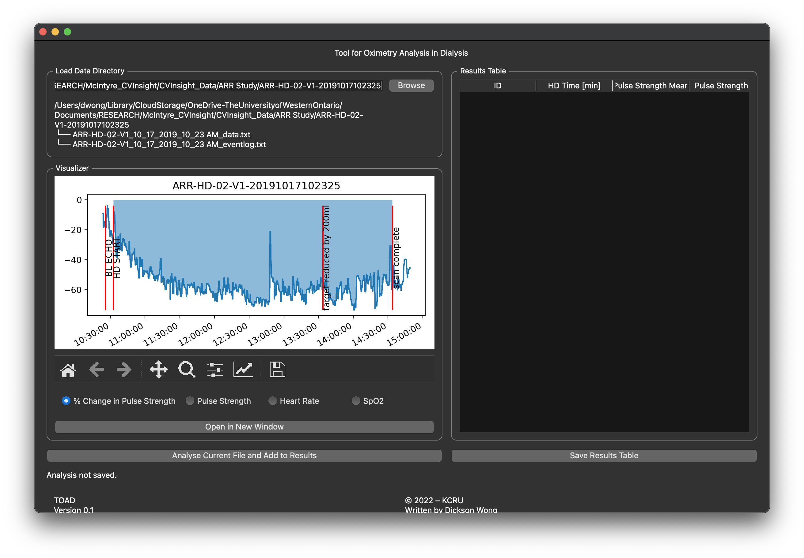
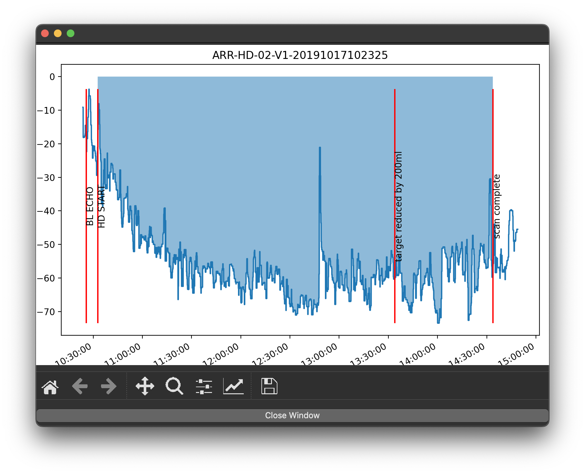
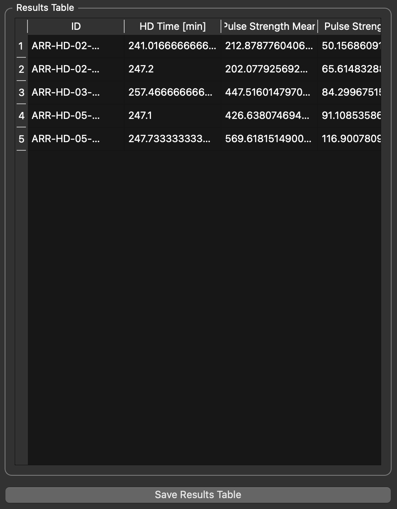
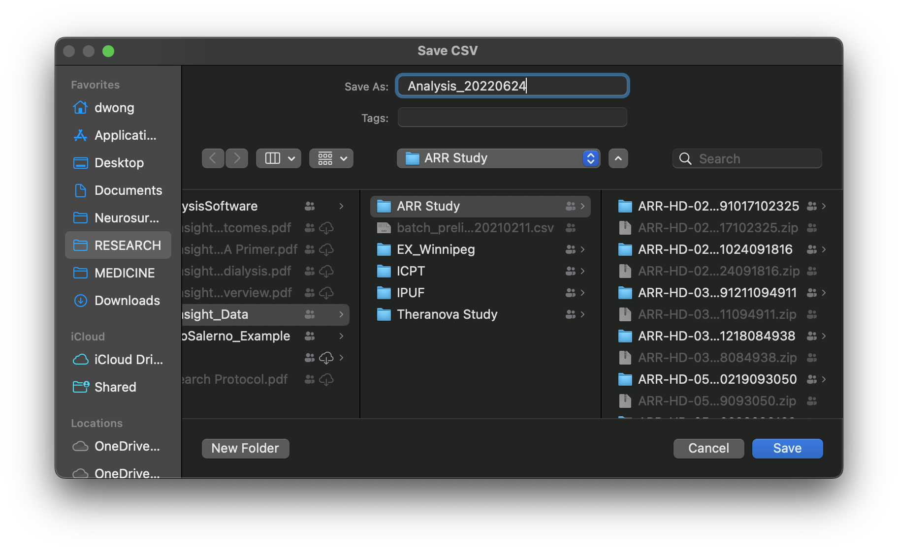
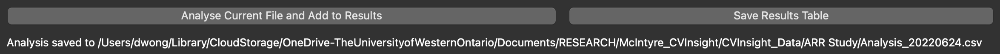
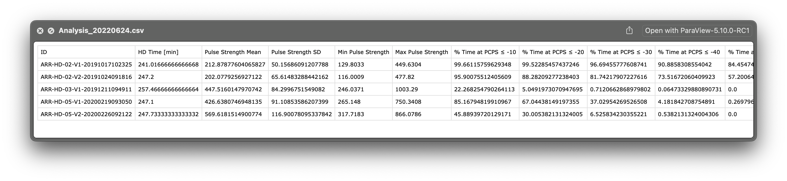

# TOAD
## Tool for Oximetry Analysis in Dialysis
This software is an in-house tool used by the Lilbeth Caberto Kidney Clinical Research Unit (KCRU) at London Health Sciences Centre (LHSC) for semi-automated analysis of CVInsight data.  This tool has been minimally tested, but should work as described below.

## Basic Usage
### Running the Application
Compiled versions of the software are provided in `compiled/macOS/`.  The author uses an M1 MacBook Pro, so only compiled versions are available for macOS arm64 (M1 and M2 MacBooks) and macOS x86_64 (Intel-based MacBooks) architectures.  If you are using Windows or Linux, please run the software with your local installation of Python.  Double-click on the application corresponding to your machine's architecture to open.

### Loading a CVInsight Dataset
Hit the `Browse` button to find the folder containing the CVInsight files for a single subject.  The software assumes there is **one** `*_data.txt` file and **one** `*_eventlog.txt` within the folder.  An example of a valid CVInsight dataset is shown below:

Hit the `Open` button to open the dataset.  If successfully read, there will be an indication showing which files are read in and a plot visualizing the % Change in Pulse Strength will be shown.

### Plotting
Plotting is done using `matplotlib` and can be manipulated using the `matplotlib` toolbar.  Several CVInsight metrics may be plotted:
1. % Change in Pulse Strength
2. Pulse Strength
3. Heart Rate
4. SpO2

Clicking the corresponding radio button will generate a plot of that metric.  The x-axis of the plot is time, while the y-axis is the metric being plotted.  Recorded comments/events in the `*_eventlog.txt` file is shown with vertical red lines and the corresponding comment.  

If the plot is too small, hit the `Open in New Window` button to launch the current plot in a larger window.

### Analysis of Metrics
To analyse the currently loaded file, hit the `Analyse Current File and Add to Results` button.  This calculates additional measurements from the CVInsight data and adds them to the _Results Table_ on the right.  The list of additional measurements this tool calculates is as follows:
* Hemodialysis time (minutes)
* Pulse strength – mean, standard deviation, minimum, maximum
* Percent of hemodialysis time at ≤ -10 ... -60 percent change in pulse strength
* Heart rate – mean, standard deviation, minimum, maximum
* Time to minimum heart rate (minutes)
* Time to maximum heart rate (minutes)
* Minimum SpO2
* Time to minimum SpO2
* Total area under the % change pulse strength curve
* Positive area under the % change pulse strength curve
* Negative area under the % change pulse strength curve

The _Results Table_ shows the results for every file analyzed in a table format.  Use your mouse/trackpad to scroll through the full table.

### Saving the Analysis
Hit the `Save Results Table` button to save the results in a `*.csv` format.  

A message at the bottom of the screen will let you know if the file is successfully saved and where it is saved.

"CSV" stands for "comma-separated values" which is a format that can be easily imported into Excel / read in by another program for further statistical analysis.

